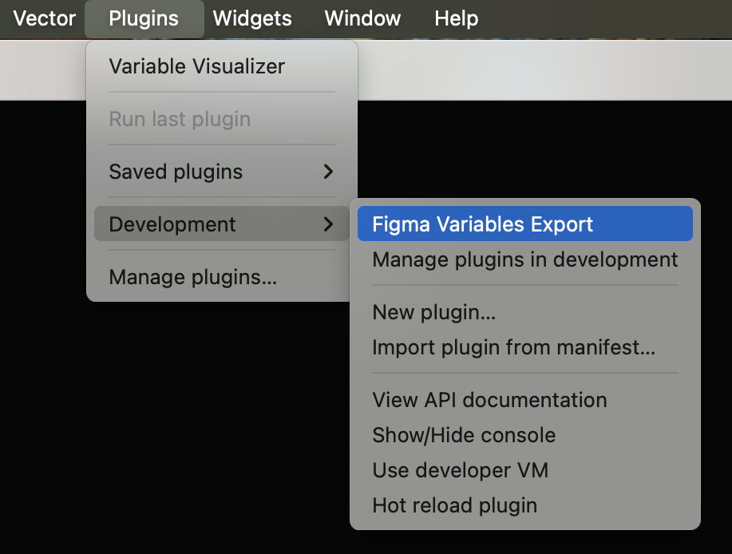

# Figma Variables Export

A plugin to export Figma variables in W3C Design Tokens format

## Development guide

_This plugin is built with
[Create Figma Plugin](https://yuanqing.github.io/create-figma-plugin/)._

### Pre-requisites

1. Install [Node Version Manager](https://github.com/nvm-sh/nvm) (nvm). It
   allows using different versions of node via the command line.
2. Install [pnpm](https://pnpm.io/) using homebrew: `brew install pnpm`.
3. Clone this repository in your preferred directory and `cd` to it.
4. Run `nvm use` to use the required version of node. If the required version is
   not installed on your machine, install it using `nvm install <version>`.

### Build the plugin

Install dependencies:

```shell
$ pnpm i
```

To build the plugin:

```shell
$ pnpm build
```

This will generate a [`manifest.json`](https://figma.com/plugin-docs/manifest/)
file and a `build/` directory containing the JavaScript bundle(s) for the
plugin.

To watch for code changes and rebuild the plugin automatically:

```shell
$ pnpm watch
```

### Install the plugin

1. In the Figma desktop app, open a Figma document.
2. Search for and run `Import plugin from manifest…` via the Quick Actions
   search bar.
3. Select the `manifest.json` file that was generated by the `build` script.
4. Now the plugin will be available for your use from the "plugins" menu.



### Debugging

Use `console.log` statements to inspect values in your code.

To open the developer console, search for and run `Show/Hide Console` via the
Quick Actions search bar.

## See also

- [Create Figma Plugin docs](https://yuanqing.github.io/create-figma-plugin/)
- [`yuanqing/figma-plugins`](https://github.com/yuanqing/figma-plugins#readme)

Official docs and code samples from Figma:

- [Plugin API docs](https://figma.com/plugin-docs/)
- [`figma/plugin-samples`](https://github.com/figma/plugin-samples#readme)
